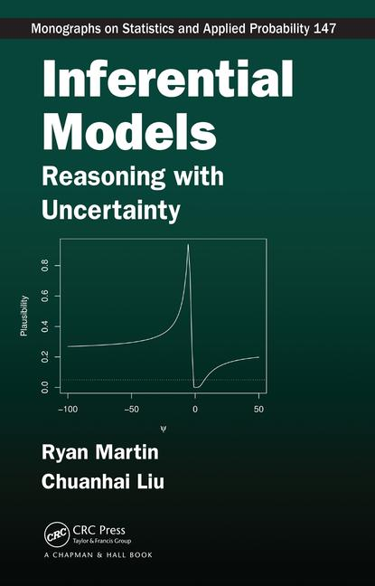

:::::: columns
::: {.column width="30%"}

:::

::: {.column width="10%"}
<!-- empty column to create gap -->
:::

::: {.column width="60%"}

This website contains useful information about Inferential Models (IMs). More information can also be found on [Ryan Martin's website](https://martinrg07.github.io/). 

:::
::::::
