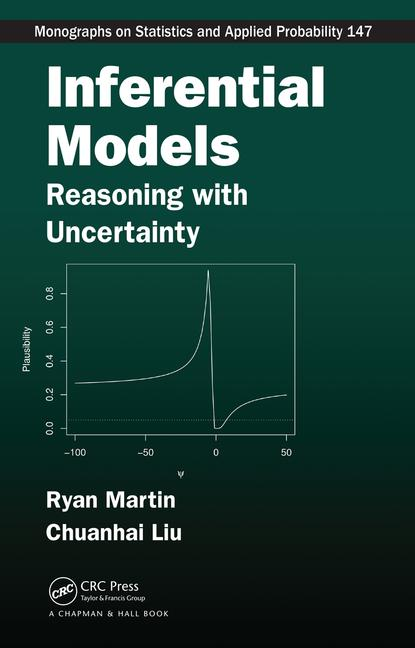

:::::: columns
::: {.column width="30%"}

:::

::: {.column width="10%"}
<!-- empty column to create gap -->
:::

::: {.column width="60%"}

Inferential Models (IMs) were first introduced by [the 2015 book](https://doi.org/10.1201/b19269), as pictured to the left, by [Ryan Martin](https://martinrg07.github.io) and [Chuanhai Liu](https://www.stat.purdue.edu/people/faculty/chuanhai.html). It provides a tool outside the Frequentist and Bayesian frameworks and offers the capability of uncertainty quantification and reliability guarantee. Succinctly, IMs can do Bayesian-like update without requiring a complete prior. 

Until now, the introduction of IMs almost solely relies on publications, which require concision and generality. To encourage interested readers explore the use of IMs, this website provides practical guides and information not easily delivered by publications, such as code, tutorials, worked-out examples, recent updates, etc.

#### Contact Us

 Email: prims@wfu.edu  

:::
::::::
